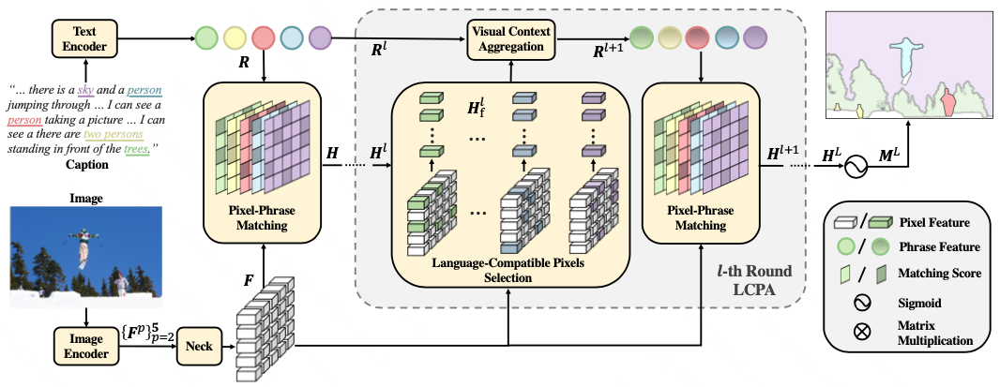

# PPMN: Pixel-Phrase Matching Network for One-Stage Panoptic Narrative Grounding



> **PPMN: Pixel-Phrase Matching Network for One-Stage Panoptic Narrative Grounding**, <br>
> [Zihan Ding*](https://scholar.google.com/citations?user=czvpD10AAAAJ&hl=zh-TW), Zi-han Ding*, [Tianrui Hui](https://scholar.google.com/citations?user=ArjkrTkAAAAJ&hl=zh-TW), [Junshi Huang](https://scholar.google.com.sg/citations?user=FFB6lzQAAAAJ&hl=en), Xiaoming Wei, Xiaolin Wei and [Si Liu](https://scholar.google.com/citations?user=-QtVtNEAAAAJ&hl=en) <br>
> *ACM MM 2022 ([arxiv 2208.05647](https://arxiv.org/abs/2208.05647))*

## News

* [2022-08-12] Code is released.

## Abstract

Panoptic Narrative Grounding (PNG) is an emerging task whose goal is to segment visual objects of things and stuff categories described by dense narrative captions of a still image. The previous two-stage approach first extracts segmentation region proposals by an off-the-shelf panoptic segmentation model, then conducts coarse region-phrase matching to ground the candidate regions for each noun phrase. However, the two-stage pipeline usually suffers from the performance limitation of low-quality proposals in the first stage and the loss of spatial details caused by region feature pooling, as well as complicated strategies designed for things and stuff categories separately. To alleviate these drawbacks, we propose a one-stage end-to-end Pixel-Phrase Matching Network (PPMN), which directly matches each phrase to its corresponding pixels instead of region proposals and outputs panoptic segmentation by simple combination. Thus, our model can exploit sufficient and finer cross-modal semantic correspondence from the supervision of densely annotated pixel-phrase pairs rather than sparse region-phrase pairs. In addition, we also propose a Language-Compatible Pixel Aggregation (LCPA) module to further enhance the discriminative ability of phrase features through multi-round refinement, which selects the most compatible pixels for each phrase to adaptively aggregate the corresponding visual context. Extensive experiments show that our method achieves new state-of-the-art performance on the PNG benchmark with 4.0 absolute Average Recall gains.

## Installation

### Requirements

- Python
- Numpy
- Pytorch 1.7.1
- Tqdm 4.56.0
- Scipy 1.5.3

### Cloning the repository

```
$ git clone git@github.com:dzh19990407/PPMN.git
$ cd PPMN
```

## Dataset Preparation

### Panoptic Narrative Grounding Benchmark

1. Download the 2017 MSCOCO Dataset from its [official webpage](https://cocodataset.org/#download). You will need the train and validation splits' images and panoptic segmentations annotations.

2. Download the Panoptic Narrative Grounding Benchmark from the PNG's [project webpage](https://bcv-uniandes.github.io/panoptic-narrative-grounding/#downloads). Organize the files as follows:

```
panoptic_narrative_grounding
|_ images
|  |_ train2017
|  |_ val2017
|_ annotations
   |_ png_coco_train2017.json
   |_ png_coco_val2017.json
   |_ panoptic_segmentation
   |  |_ train2017
   |  |_ val2017
   |_ panoptic_train2017.json
   |_ panoptic_val2017.json
```

3. Pre-process the Panoptic narrative Grounding Ground-Truth Annotation for the dataloader using [utils/pre_process.py](utils/pre_process.py).

4. At the end of this step you should have two new files in your annotations folder.

```
panoptic_narrative_grounding
|_ annotations
   |_ png_coco_train2017.json
   |_ png_coco_val2017.json
   |_ png_coco_train2017_dataloader.json
   |_ png_coco_val2017_dataloader.json
   |_ panoptic_segmentation
   |  |_ train2017
   |  |_ val2017
   |_ panoptic_train2017.json
   |_ panoptic_val2017.json
```

## Train and Inference

Modify the routes in [train_net.sh](train_net.sh) according to your local paths. If you want to only test the pretrained model, add `--ckpt_path ${PRETRAINED_MODEL_PATH}` and `--test_only`.

## Pretrained Model

To reproduce all our results as reported bellow, you can use our [pretrained model](https://drive.google.com/drive/folders/1uVlrcAC5or_Vne8i9n0mFfLeNuXffrlW?usp=sharing) and our source code.

| Method | things + stuff | things | stuff |
| :----: | :------------: | :----: | :---: |
|  PNG |      55.4      |  56.2  | 54.3  |
|  MCN   |       -        |  48.2  |   -   |
|  PPMN |    59.4   |  57.2  |  62.5   |

| Method | singulars + plurals | singulars | plurals |
| :----: | :-----------------: | :-------: | :-----: |
| PNG |        55.4         |   56.2    |  48.8   |
| PPMN |        59.4         |   60.0    |  54.0   |


## Citation

```
@inproceedings{Ding_2022_ACMMM,
    author    = {Ding, Zihan and Ding, Zi-han and Hui, Tianrui and Huang, Junshi and Wei, Xiaoming and Wei, Xiaolin and Liu, Si},
    title     = {PPMN: Pixel-Phrase Matching Network for One-Stage Panoptic Narrative Grounding},
    booktitle = {Proceedings of the 30th ACM International Conference on Multimedia},
    year      = {2022}
```

## Acknowledge

Some of the codes are built upon [K-Net](https://github.com/ZwwWayne/K-Net) and [PNG](https://github.com/BCV-Uniandes/PNG). Thanks them for their great works!